# Log2space Mobile App — Screen Guide

**Client:** Spacecom Broadband Pvt Ltd (`spacecom-local`)  
**App:** Log2space subscriber app  
**Version shown:** 1.0.1 (1)

This document lists each main screen with a one-line explanation.

---

## 1. Login

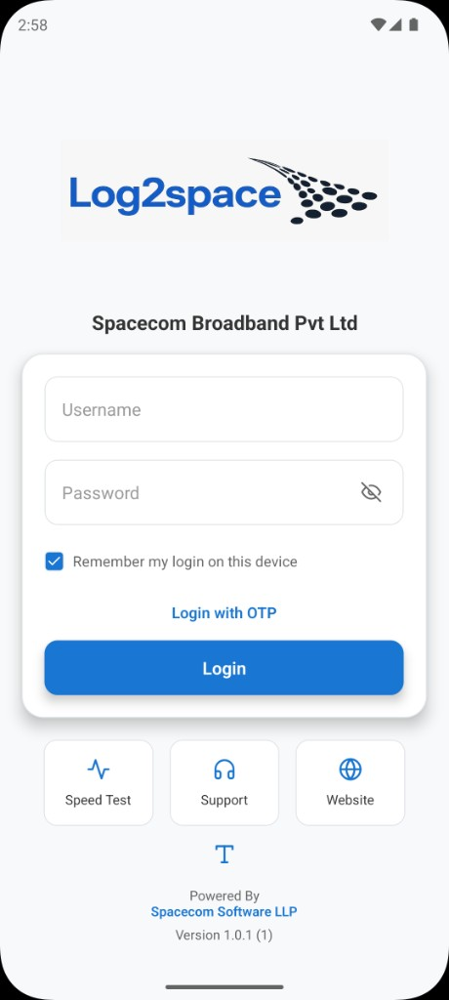

Sign in with username and password; optional OTP login, remember-me, and quick links for Speed Test, Support, and Website.

---

## 2. Secure Your Account

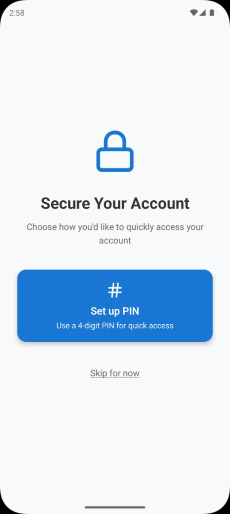

Post-login security setup — choose a 4-digit PIN for quick access or skip for later.

---

## 3. Home

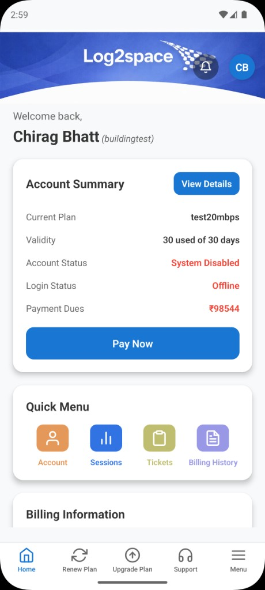

Dashboard with account summary (plan, validity, status, dues), Pay Now, quick menu shortcuts, and billing overview.

---

## 4. Account Details

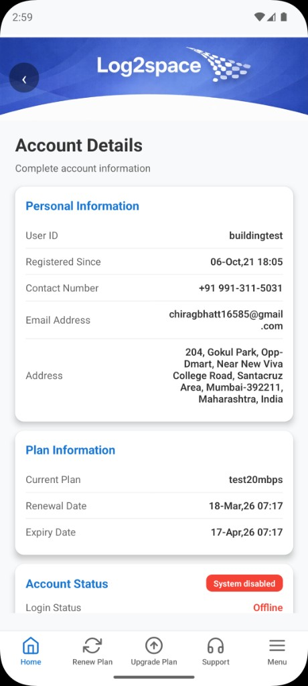

Full subscriber profile — user ID, contact, address, plan dates, and account/login status.

---

## 5. Menu

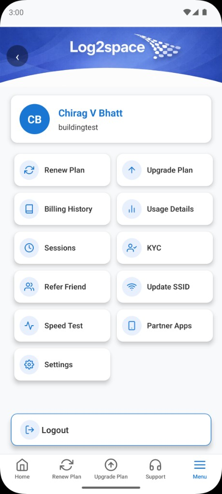

Main hub grid — renew/upgrade, billing, usage, sessions, KYC, refer friend, Wi‑Fi, speed test, partner apps, and settings.

---

## 6. Settings

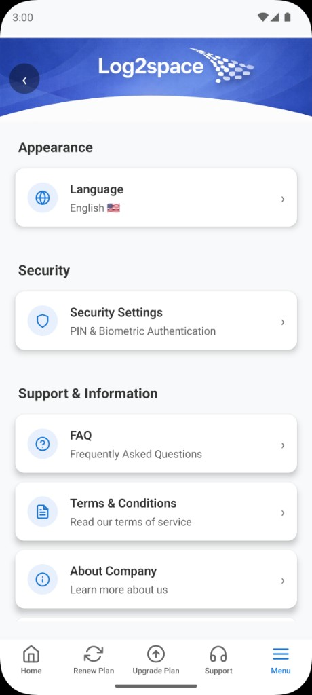

App preferences — language, security (PIN/biometric), FAQ, terms, about, version, and update check.

---

## 7. Renew Plan

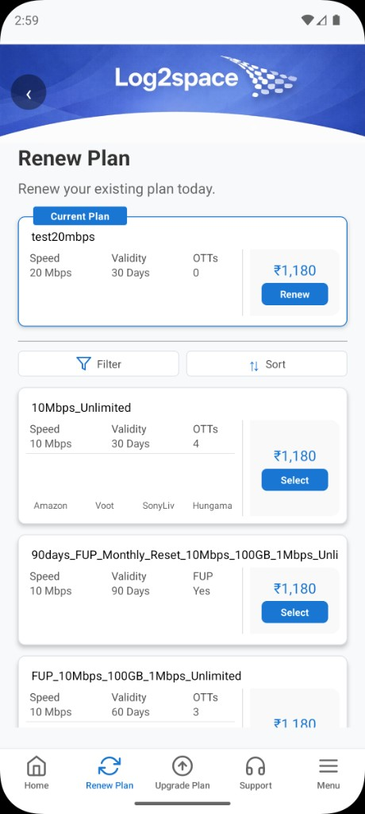

Browse and renew the current plan or select another plan with speed, validity, OTT, and price.

---

## 8. Plan Review & Payment

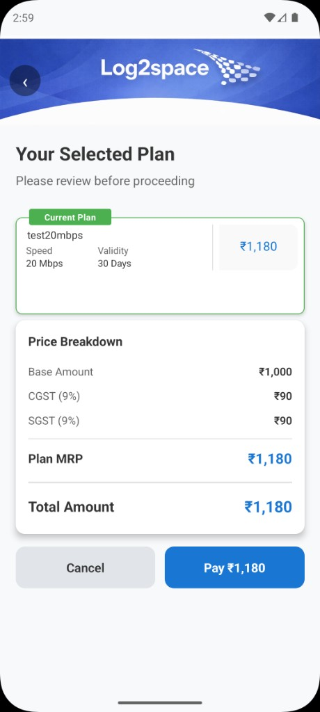

Review selected plan, price breakdown (base + GST), and proceed to pay or cancel.

---

## 9. Billing History

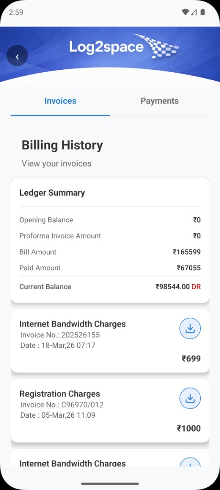

Ledger summary and invoice list with download; switch between Invoices and Payments tabs.

---

## 10. Usage Details

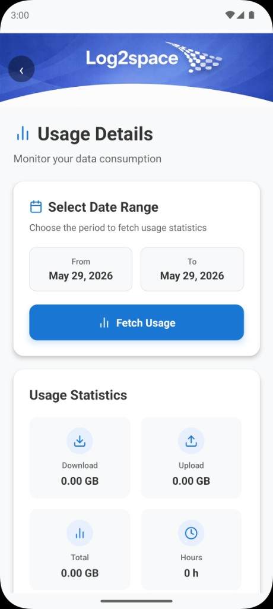

Pick a date range and fetch download, upload, total data, and session hours.

---

## 11. Session History

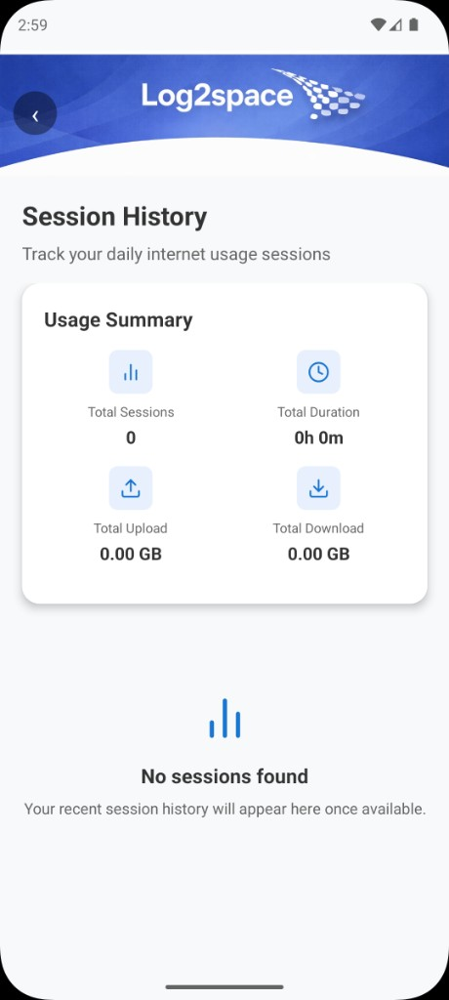

Summary of sessions (count, duration, upload/download) and list of daily usage sessions.

---

## 12. View KYC

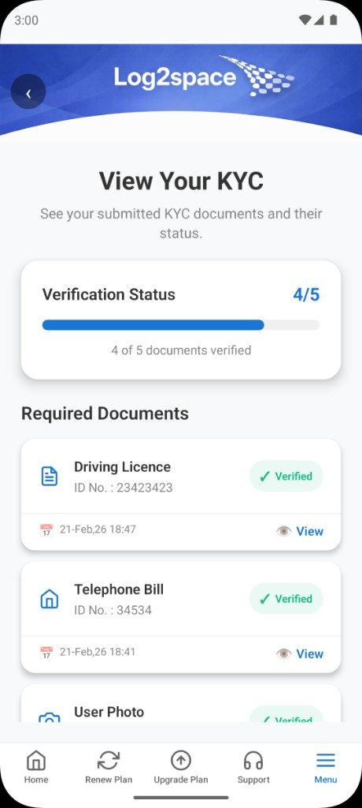

Track submitted KYC documents, verification progress, and view each document.

---

## 13. Refer a Friend

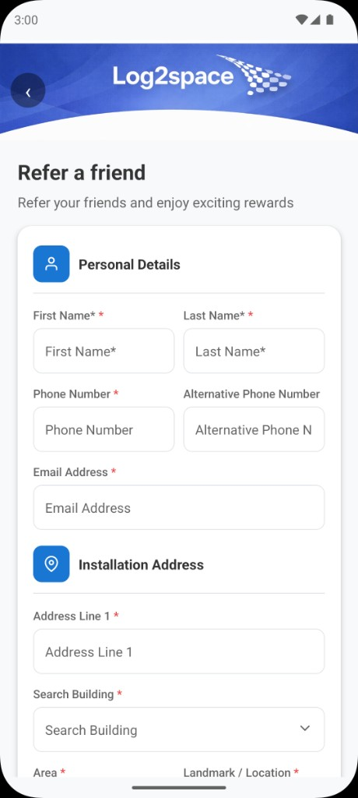

Referral form — friend’s personal details and installation address for new connection.

---

## 14. Update SSID Settings

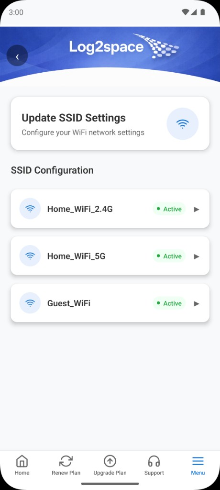

List Wi‑Fi networks (2.4G, 5G, guest) to view or change SSID/password settings.

---

## 15. Partner Apps

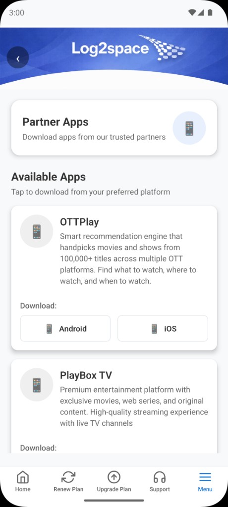

Download partner OTT apps (e.g. OTTPlay, PlayBox TV) from Play Store or App Store.

---

## 16. Support (Contact Us)

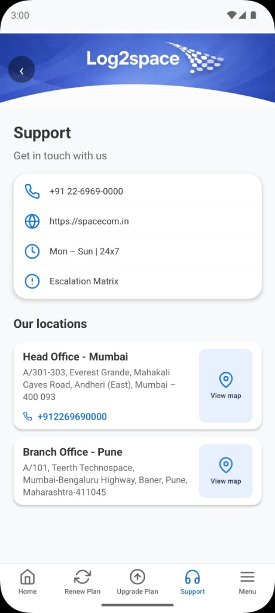

Contact phone, website, hours, escalation matrix, and office locations with map links.

---

## 17. Support Tickets

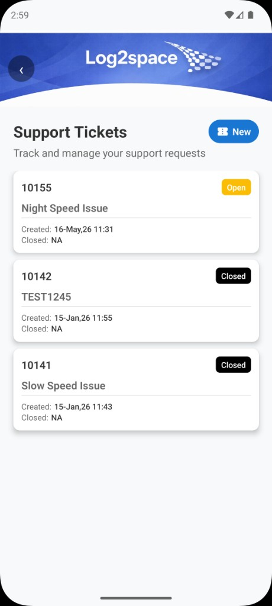

List of support complaints with open/closed status, subject, and created date.

---

## 18. Create New Complaint

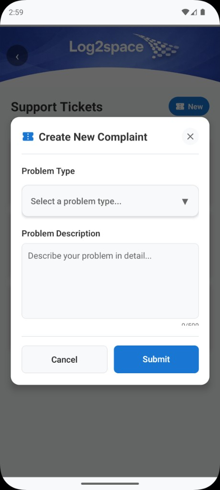

Raise a new ticket — select problem type, describe the issue (up to 500 characters), and submit.

---

*Generated from app screenshots — Log2space / Spacecom Broadband Pvt Ltd.*
